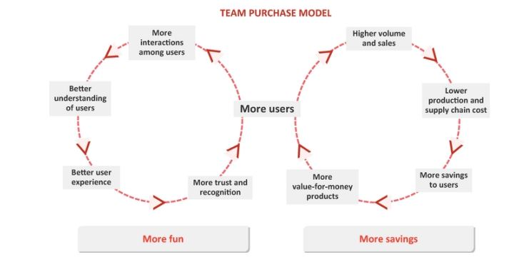
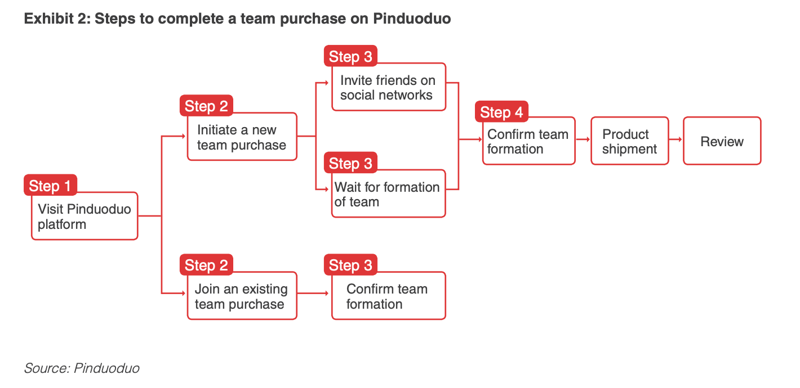
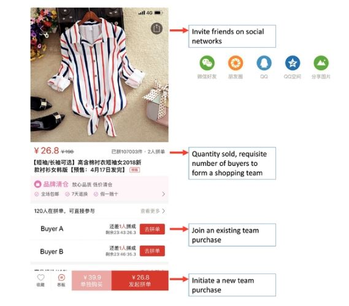
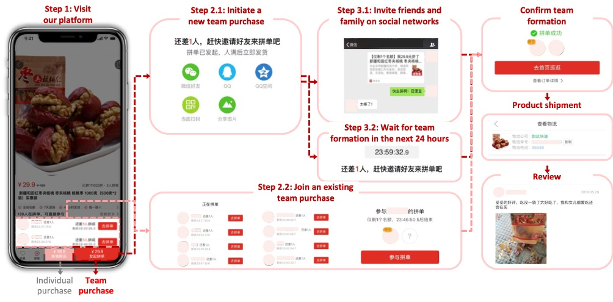

<h1 align="center">🌊 Cart share with a friend like Pinduoduo 🌊</h1>

<strong>The rise of Social E-Commerce</strong>

## Screenshot

<!-- <p align="center"></p> -->

## Architecture

<p align="center"></p>
<p align="center"></p>
<p align="center"></p>
<p align="center"></p>

## Getting started

```
npm install
npm run dev
npm run build
```

## FAQ's

<details>
<summary>So, ecommerce social will replace ecomerce classic ?</summary><br><b>

> No, it all about price and customer care system.

</details>
